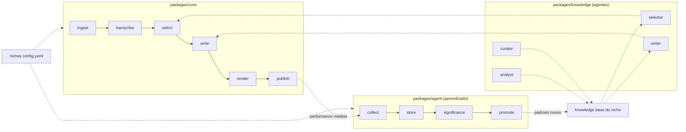

<div align="center">


# cutgen

**Motor genérico + agentes que aprendem padrões virais, para transformar
vídeos-fonte em cortes verticais — sem hardcoding de nicho.**

[](https://github.com/IsaacRop/cutgen/actions/workflows/ci.yml)
[](LICENSE)
[](pyproject.toml)
[](https://docs.astral.sh/uv/)

</div>

---

cutgen é a generalização open source de um pipeline de produção real (um
canal de Shorts que já roda em produção). **O mecanismo é público; os
dados, padrões e números específicos de qualquer canal não são** — veja
[SECURITY.md](SECURITY.md).

Tudo que é específico de nicho — fontes, template visual, hashtags,
categoria de publicação, limiares do agente — entra por um único ponto:
`niches/<niche>/config.yaml`. O código nunca sabe de que nicho se trata.

## 🧭 Como está organizado

Workspace [uv](https://docs.astral.sh/uv/) com quatro pacotes:

| Pacote | O que faz |
| --- | --- |
| **`packages/shared`** | `metrics_schema.json` — o contrato de dados entre `core` e `agent`. |
| **`packages/knowledge`** | Os quatro agentes (`analyst`, `curator`, `selector`, `writer`) como prompts + skills do Claude Code, e como funções Python chamáveis fora do Claude Code via `cutgen_knowledge.llm.client`. |
| **`packages/core`** | O pipeline: `ingest → transcribe → select → write → render → publish`. Cada módulo lê o que precisa de `niches/<niche>/config.yaml`. |
| **`packages/agent`** | Loop de aprendizado a partir de performance real: `collect` (YouTube Data API) → `store` (SQLite) → `significance` (evidência estatística mínima) → `promote` (escreve/atualiza `knowledge/niches/<niche>/patterns/`). |

Dados de runtime (não código) ficam na raiz do repo:

- **`niches/<niche>/config.yaml`** — toda configuração específica de nicho: fontes de download, modelo/idioma de transcrição, fonte/cores/censura da legenda, hashtags-base, categoria/idioma/privacidade de publicação, limiares do agent.
- **`knowledge/niches/<niche>/`** — `examples/` (referências virais ingeridas), `patterns/` (padrões destilados) e `PATTERNS.md` (índice). Cresce com o uso; começa vazio.

> `niches/example-niche/` é um esqueleto fictício — mostra o formato
> esperado, não é um nicho de verdade. Copie a pasta e preencha com os
> valores do seu próprio canal.

## 🔁 O pipeline



1. **ingest** (`cutgen_core.ingest`) — baixa (yt-dlp) uma fonte pra `input/` (make-cut) ou uma referência viral pra `refs/`, transcreve, e escreve o esqueleto em `knowledge/niches/<niche>/examples/`.
2. **transcribe** (`cutgen_core.transcribe`) — `faster-whisper` em blocos, com timestamps por palavra (salva progresso parcial a cada bloco).
3. **select** (`cutgen_core.select`) — chama o agente `selector`, que lê a transcrição + `PATTERNS.md` do nicho e recomenda o trecho de 30-90s com maior potencial.
4. **write** (`cutgen_core.write`) — chama o agente `writer`, que gera título/descrição/hashtags a partir dos padrões do nicho.
5. **render** (`cutgen_core.render`) — gera a legenda karaokê (`.ass`) e monta/roda o comando `ffmpeg` (recorte + legenda + normalização de áudio). Layout único e simples por enquanto — ver "O que não está aqui" mais abaixo.
6. **publish** (`cutgen_core.publish`) — sobe pro YouTube via OAuth (`google-api-python-client`).

O agente `analyst` preenche a análise de cada referência ingerida; o agente
`curator` consolida exemplos em padrões (`/consolidate`); o `cutgen_agent`
fecha o loop automaticamente a partir de performance medida.

## ⚡ Uso rápido (dentro do Claude Code)

As skills em `packages/knowledge/skills/` (`ingest-ref`, `consolidate`,
`make-cut`) orquestram o pipeline via subagentes — é o jeito recomendado de
usar isto dentro do Claude Code. Veja cada `SKILL.md` pro fluxo exato.

## 🖥️ Uso fora do Claude Code

Cada módulo do `core` também roda como CLI, chamando os agentes via API
(`cutgen_knowledge.llm.client`, que precisa de `CUTGEN_LLM_API_KEY`):

```bash
uv sync --all-packages --all-extras

python -m cutgen_core.ingest <url> --niche example-niche
python -m cutgen_core.transcribe input/<arquivo> --niche example-niche
python -m cutgen_core.render --video input/<arquivo> --words processing/<stem>.words.json \
    --start <S> --end <E> --name <nome> --niche example-niche
python -m cutgen_core.publish output/<nome>.mp4 "<titulo>" "<descricao>" "<tags>" --niche example-niche

python -m cutgen_agent.promote --niche example-niche
```

## 🚧 O que não está aqui (ainda)

Generalizar um pipeline de produção significa separar mecanismo de dado.
Ficou de fora deste MVP, de propósito, o que é *design visual específico de
formato/marca* em vez de mecanismo genérico:

- Layouts alternativos de render (split-screen com fundo, foco, post, reação) e transições animadas — hoje `cutgen_core.render` só cobre um layout simples (recorte + legenda queimada + trilha).
- As skills `meme`/`news-card`/`save-ig-ref` do pipeline original, que geram formatos de post de imagem específicos de marca.

Ambos são bons pontos de extensão via `niches/<niche>/config.yaml` (um
sistema de layouts plugável), mas não foram recriados aqui — ver
`packages/core/src/cutgen_core/render.py` para o raciocínio completo.

## 🛠️ Desenvolvimento

```bash
uv sync --all-packages --all-extras --dev
uv run pytest packages/shared/tests packages/knowledge/tests packages/core/tests packages/agent/tests
uv run ruff check packages/
```

Veja [CONTRIBUTING.md](CONTRIBUTING.md) para o fluxo de contribuição e
[SECURITY.md](SECURITY.md) para o que nunca deve entrar num PR.

## 📄 Licença

MIT — ver [LICENSE](LICENSE).
